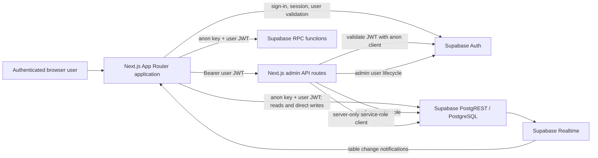
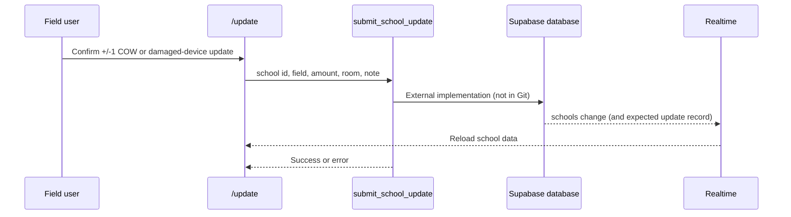

# Architecture

## Scope and evidence

This document describes the current repository. Supabase-hosted schema, RLS policies, triggers, and function bodies are not checked in, so the database internals shown as external boundaries require human verification. Supplied project history names Vercel as the production host, but there is no deployment configuration or infrastructure-as-code in Git.

## System overview

### Frontend

- Next.js 14 App Router pages live under `app/`.
- All workflow pages except the root redirect are client components (`"use client"`).
- `app/layout.tsx` wraps every page in `components/AppShell.tsx`.
- Shared presentation and calculations live in `components/` and `lib/utils.ts`.
- `lib/supabaseClient.ts` creates one browser-capable Supabase client from public environment variables.
- Styling is global in `app/globals.css`; Framer Motion supplies page/modal transitions and Lucide supplies navigation icons.

### Backend boundaries

The repository contains no general-purpose Next.js backend or ORM. Most application data access goes directly from the browser to Supabase using the current user's session. Two Node.js API routes use a server-only service-role client for privileged operations:

- `app/api/admin/users/route.ts`
- `app/api/admin/reset/route.ts`

Three Supabase RPCs are called from client pages:

- `submit_school_update`
- `get_update_submitters`
- `delete_update_and_reverse`

Their SQL definitions are external and must be inspected in the connected Supabase project.

## Route map

| Route | File | Behavior |
| --- | --- | --- |
| `/` | `app/page.tsx` | Server redirect to `/dashboard` |
| `/login` | `app/login/page.tsx` | Email/password sign-in with Supabase Auth |
| `/dashboard` | `app/dashboard/page.tsx` | Area-filtered school aggregates, progress, search, and staffing indicators |
| `/schools` | `app/schools/page.tsx` | Area/school detail, updates, total-COW history, supervisor/admin edit controls |
| `/update` | `app/update/page.tsx` | Numerical field adjustments through RPC and direct general-note inserts |
| `/summary` | `app/summary/page.tsx` | End-of-day aggregates, filters, submitter names, admin delete-and-reverse control |
| `/admin` | `app/admin/page.tsx` | Client-gated user/role management and reset UI |
| `/api/admin/users` | `app/api/admin/users/route.ts` | Admin-verified account creation and deletion |
| `/api/admin/reset` | `app/api/admin/reset/route.ts` | Admin-verified operational-cycle reset |

## Authentication and route protection

`components/AppShell.tsx` calls `supabase.auth.getSession()` for every non-login route. If no session exists, it uses `router.replace("/login")`; otherwise it loads the current user's `profiles` row through `lib/auth.ts`. Sign-in uses `supabase.auth.signInWithPassword()` and sign-out uses `supabase.auth.signOut()`.

This is client-side route gating, not Next.js middleware or server-side page authorization. The repository contains no `middleware.ts`. Sensitive server APIs independently validate the bearer token and admin role; direct browser-to-Supabase operations must be enforced by RLS.

`app/admin/page.tsx` performs a second client-side profile check and redirects non-admin users. That protects navigation behavior but is not, by itself, a security boundary.

## Authorization model

The repository recognizes `intern`, `supervisor`, and `admin`.

- The shell displays the Admin link only for an `admin` profile.
- School total and mark-complete controls display for `supervisor` or `admin`.
- The summary delete control displays only for `admin`.
- The admin page blocks self-role edits and self-deletion in its UI.
- Admin user and reset API routes validate the JWT and read the requester's role before using the service role.
- Role edits, school edits, update/note inserts, data reads, and RPC execution still depend on Supabase-side grants/RLS/function checks that are not in Git.

See [Security](SECURITY.md) for the enforcement matrix.

## Data access and flow

### Numerical field update

The client makes one RPC call, which replaced a historical two-write client flow. The supplied context says the function updates the school total and inserts the activity record together. That intent is plausible and important, but atomicity, role checks, bounds, and attribution cannot be verified without the SQL.

### General note

`app/update/page.tsx` inserts directly into `updates` with `school_id`, zero numerical effects, room, and notes. It does not send `user_id`. A database default or trigger could add attribution, but none is version-controlled; therefore attribution for this path is unverified.

### Submitter display

`app/summary/page.tsx` and `app/schools/page.tsx` load updates and call `get_update_submitters` in parallel. Each page maps the returned `{ id, full_name }` values to `updates.user_id` and attaches a display-only `profiles.full_name` shape consumed by `components/UpdateCard.tsx`. Missing IDs/names display as `Unknown user`.

### School-total changes

`app/schools/page.tsx` directly updates `schools.total_cows`, then separately inserts `cow_total_changes`. These two operations are not atomic in the client. If logging fails, the total remains changed and the page warns the user. “Mark Complete” directly sets `completed_cows` to `total_cows` and creates no update or audit-history record in repository code.

### Delete and reverse

`app/summary/page.tsx` calls `delete_update_and_reverse` with an update ID after an admin-only UI confirmation. The supplied context says the function verifies admin access, locks the update, reverses its numerical effect without allowing negative totals, and deletes atomically. Only the call and UI are repository-verified; the function's enforcement and transaction behavior are external.

### Dashboard reset

`app/api/admin/reset/route.ts` validates the caller as an admin and then, using the service role, performs three sequential operations: delete `updates`, delete `cow_total_changes`, and set schools' `completed_cows` and `damaged_devices` to zero. Each operation applies `.neq("id", "00000000-0000-0000-0000-000000000000")`, apparently as an “all normal rows” filter; an actual zero-UUID row would be excluded. The route preserves schools, profiles, roles, and `total_cows`. The sequence is not wrapped in a repository-visible transaction, so partial reset is possible if a later operation fails.

## Realtime behavior

| Page | Channel | Watched tables | Response |
| --- | --- | --- | --- |
| Dashboard | `dashboard-schools` | `schools` | Reload schools and areas |
| School detail | `school-detail` | `schools`, `updates`, `cow_total_changes` | Reload all page datasets and submitter lookup |
| Intern update | `intern-update` | `schools` | Reload schools and areas |
| Summary | `summary` | `schools`, `updates` | Reload schools, areas, updates, and submitter lookup |

Every subscription listens for all PostgreSQL change event types in the `public` schema. Realtime publication configuration, channel authorization, and RLS behavior are external to the repository.

## Admin APIs

Both API routes:

1. require `NEXT_PUBLIC_SUPABASE_URL`, `NEXT_PUBLIC_SUPABASE_ANON_KEY`, and `SUPABASE_SERVICE_ROLE_KEY`;
2. extract a bearer access token;
3. validate the user through `auth.getUser()` using an anon client carrying that token;
4. query the caller's `profiles.role`; and
5. create a non-persisting service-role client only after validation.

The users route validates names, email syntax, password length, and role; creates an already-confirmed Auth user; upserts the profile; and rolls back the Auth user if profile creation fails. Deletion prevents self-deletion and deletion of the last admin, but deletes the profile before the Auth account, so that path is not atomic.

The users route also has an in-memory limit of ten requests per minute per HTTP method and apparent client IP. It is process-local and is not a durable distributed rate limiter. The reset route has no equivalent rate limit.

## Build and deployment

`next build` produces the production application and `next start` serves it. Supplied history says the application is deployed on Vercel and uses Vercel-provided HTTPS. Git contains no Vercel configuration, deployment workflow, domain record, monitoring setup, or rollback instructions. Deployment remains a manual/platform configuration boundary described in [Contributing](CONTRIBUTING.md) and [Open Questions](OPEN_QUESTIONS.md).

## Known architectural gaps

- No schema migrations, RLS definitions, grants, triggers, or RPC SQL are version-controlled.
- General route protection and the admin page gate are client-side.
- Direct mutations rely on external RLS, including role editing and supervisor controls.
- Total-COW update plus history insert, user deletion, and dashboard reset are multi-step and non-atomic in repository code.
- No automated tests, observability configuration, backup procedure, or recovery runbook is present.
- Database types in `types/database.ts` are handwritten domain types, not a generated complete Supabase schema.
